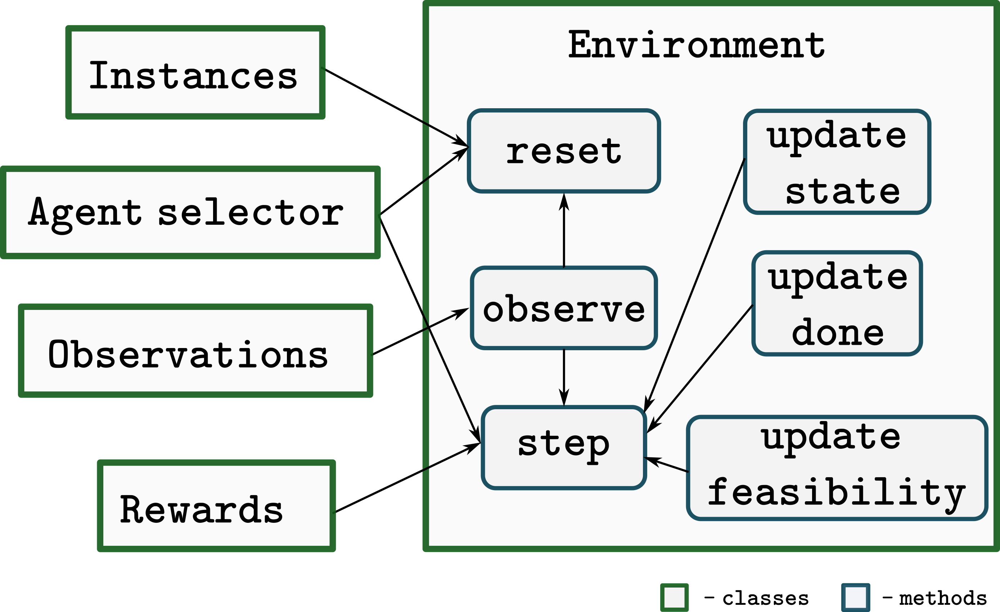

:hide-toc:

==============================
Modules
==============================

Our environments follow mainly the PettingZoo Agent Environment Cycle games model (AEC), [PettingZoo]_. We have also been greatly influenced by [Flatland]_ environments library. 

We chose to adopt some of its design principles which we believe considerably improves the generality and usability of the created environments. 

Concretely, each functional component of the environments was separated into different modules, in order to enhance design freedom and broadness. 

This led to the definition of four key functional modules: Instance Generator, Observations Generator, Agent Selector and Rewards classes:

- `Instance Generation <Instance%20Generator/instance-generator.html>`_ - Module responsible for problem instance space definition, generation, and sampling. It allows fast exploration of new instance distributions and straightforward adoption of standard benchmark instance data;
- `Observations <Observations/observations.html>`_ - One important aspect of agent's training is their ability to retrieve useful information from the environment in order to act on it. Maintaining an independent customizable observation class, empowers feature engineering and observation space exploration, opening the possibility for the creation of more aware and capable agents;
- `Agent Selector <Agent%20Selector/agent-selector.html>`_ - Equivalent to [PettingZoo]_, the Agent Selector class controls the selection of the next agent that will interact with the environment, through the _next_agent method. 
- `Agent Rewards <Agent%20Reward/agent-reward.html>`_ - All agent's reward methods are defined in this class.

All information management and agents control is carried out by the `Environment <Environment/environment.html>`_.

.. toctree::
    :maxdepth: 1
    :hidden:

    Agent Reward/agent-reward
    Agent Selector/agent-selector
    Environment/environment
    Instance Generator/instance-generator
    Observations/observations

References
---------------

.. [PettingZoo] J Terry, Benjamin Black, Nathaniel Grammel, Mario Jayakumar, Ananth Hari, Ryan Sullivan, Luis S Santos, Clemens Dieffendahl, Caroline Horsch, Rodrigo Perez-Vicente, Niall Williams, Yashas Lokesh, and Praveen Ravi. Pettingzoo: Gym for multi-agent reinforcement learning. In M. Ranzato, A. Beygelzimer, Y. Dauphin, P.S. Liang, and J. Wortman Vaughan, editors, Advances in Neural Information Processing Systems, volume 34, pages 15032–15043. Curran Associates, Inc., 2021, `<https://pettingzoo.farama.org/>`_ .

.. [Flatland] Sharada Prasanna Mohanty, Erik Nygren, Florian Laurent, Manuel Schneider, Christian Vibe Scheller, Nilabha Bhattacharya, Jeremy Donald Watson, Adrian Egli, Christian Eichenberger, Christian Baumberger, Gereon Vienken, Irene Sturm, Guillaume Sartoretti, and Giacomo Spigler. Flatland-rl : Multi-agent reinforcement learning on trains. ArXiv, abs/2012.05893, 2020, `<https://flatland.aicrowd.com/>`_ 